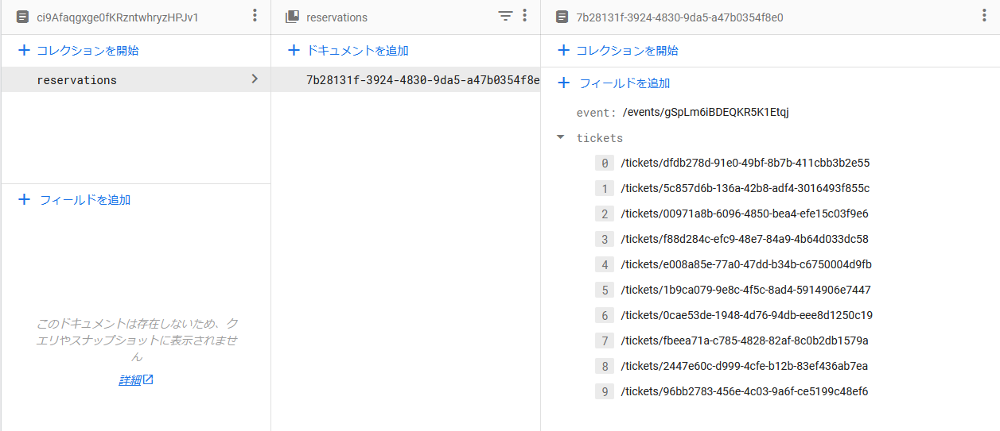

# このドキュメントを読む前に
このドキュメントは、データベースの構造を説明します。

ただし、このドキュメントで扱われているデータの多くはMayaによって自動的に管理されており、不用意に触るべきではありません。

## おそらく触るであろうデータ一覧
- [admin](https://github.com/Maya-org/Maya-doc/blob/main/doc/backend/DB-scheme.md#admin)
- [events](https://github.com/Maya-org/Maya-doc/blob/main/doc/backend/DB-scheme.md#events)
- [ticketTypes](https://github.com/Maya-org/Maya-doc/blob/main/doc/backend/DB-scheme.md#tickettypes)

# DBの構成について

Mayaでは各種イベント情報や混雑情報などをすべてFirebaseの[RealTimeDB](https://firebase.google.com/docs/database)
あるいは、[FireStore](https://firebase.google.com/docs/firestore)に保存しています。

このドキュメントでは、そこに保存されるデータの構成を説明します。

# 使用されるDBの種類について

イベントの予約情報などはすべて[FireStore](https://firebase.google.com/docs/firestore)に保存されます。

リアルタイム更新の混雑状況はすべて[RealTimeDB](https://firebase.google.com/docs/database)に保存されます。

# FireStore内のデータの構造について

使用されるデータ構造のルートコレクションは以下の通りです。

**詳しいデータ構造については[Backend](https://github.com/Maya-org/Maya-Reservation-Backend/blob/main/openapi/reference/Reservation-API.json)のOpenAPIドキュメントを参照してください。**

- [admin](https://github.com/Maya-org/Maya-doc/blob/main/doc/backend/DB-scheme.md#admin)
- [events](https://github.com/Maya-org/Maya-doc/blob/main/doc/backend/DB-scheme.md#events)
- [reservations](https://github.com/Maya-org/Maya-doc/blob/main/doc/backend/DB-scheme.md#reservations)
- [rooms](https://github.com/Maya-org/Maya-doc/blob/main/doc/backend/DB-scheme.md#rooms)
- [ticketTypes](https://github.com/Maya-org/Maya-doc/blob/main/doc/backend/DB-scheme.md#tickettypes)
- [tickets](https://github.com/Maya-org/Maya-doc/blob/main/doc/backend/DB-scheme.md#tickets)
- [track](https://github.com/Maya-org/Maya-doc/blob/main/doc/backend/DB-scheme.md#track)

## admin
`admin`は主に権限情報を保存します。

`uid`のドキュメントの下に権限情報を保存します。

構造は以下の画像の通りです。 

## events
`events`はイベント情報を保存します。

イベント情報はイベントIDをキーとして保存します。

構造は以下の画像の通りです。 

## reservations
`reservations`は予約情報を保存します。

予約情報は`uid`をキーとして、その下の`reservations`コレクションの中に予約IDをキーとして保存します。

構造は以下の画像の通りです。 
 

## rooms
`rooms`は部屋情報を保存します。

部屋情報は部屋IDをキーとして保存します。

構造は以下の画像の通りです。 
 

## ticketTypes
`ticketTypes`はチケットタイプ情報を保存します。

チケットタイプ情報はチケットタイプIDをキーとして保存します。

構造は以下の画像の通りです。 

## tickets
`tickets`はチケット情報を保存します。

チケット情報はチケットIDをキーとして保存します。

構造は以下の画像の通りです。 

## track
`track`はお客さんの移動履歴を保存します。

移動履歴データはチケットIDをキーとして保存し、その下の`tracks`コレクションに移動履歴を保存します。

構造は以下の画像の通りです。 
 

# RealTimeDB内のデータの構造について
RealTimeDB内には現在のお客さんの滞在状況を保存します。

部屋のIDをキーとして、その値に現在の滞在人数を保存します。

構造は以下の画像の通りです。 
