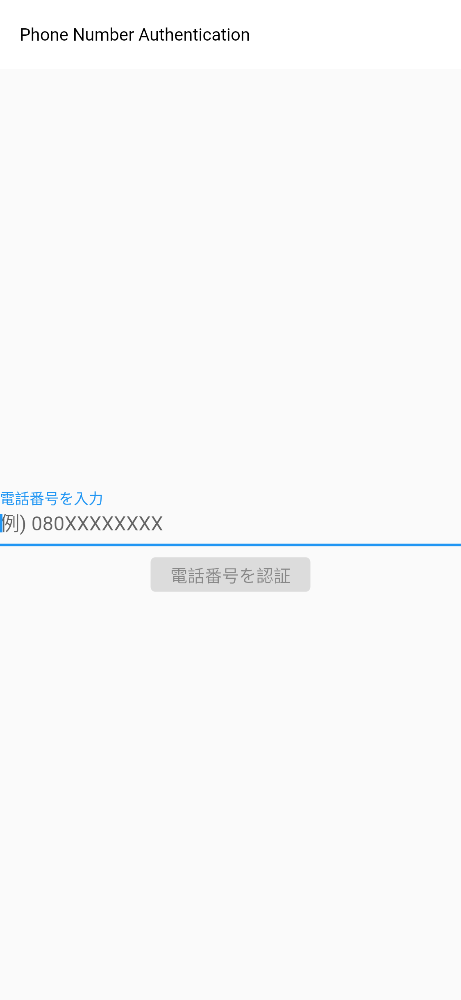
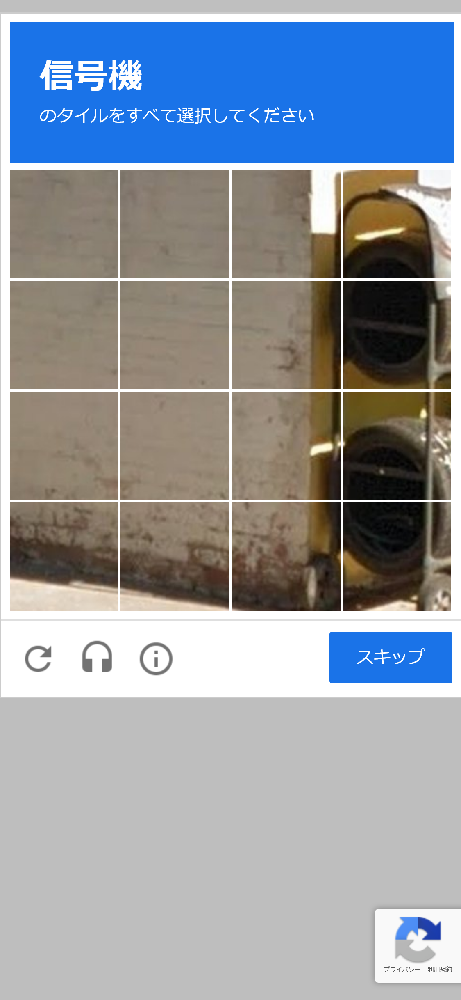
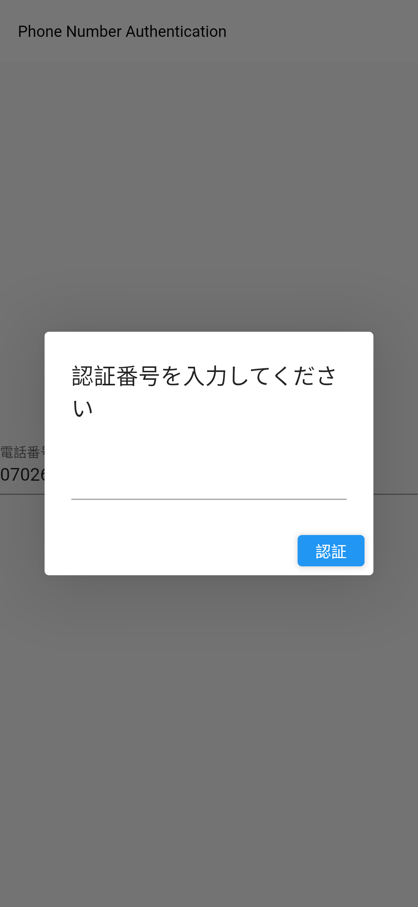
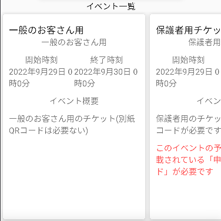
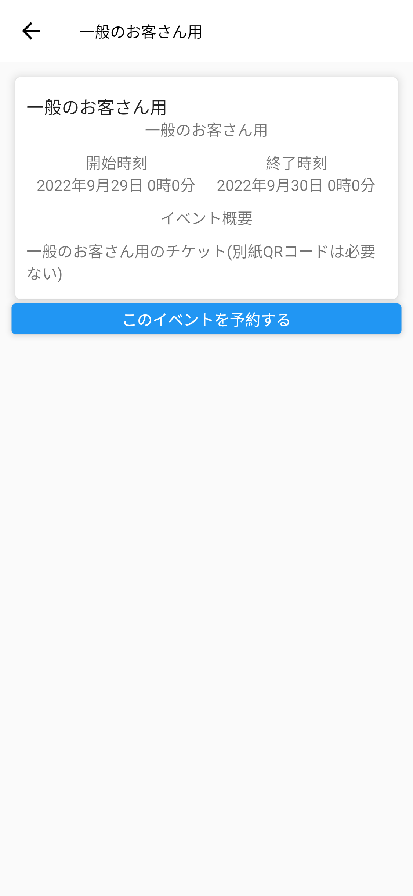
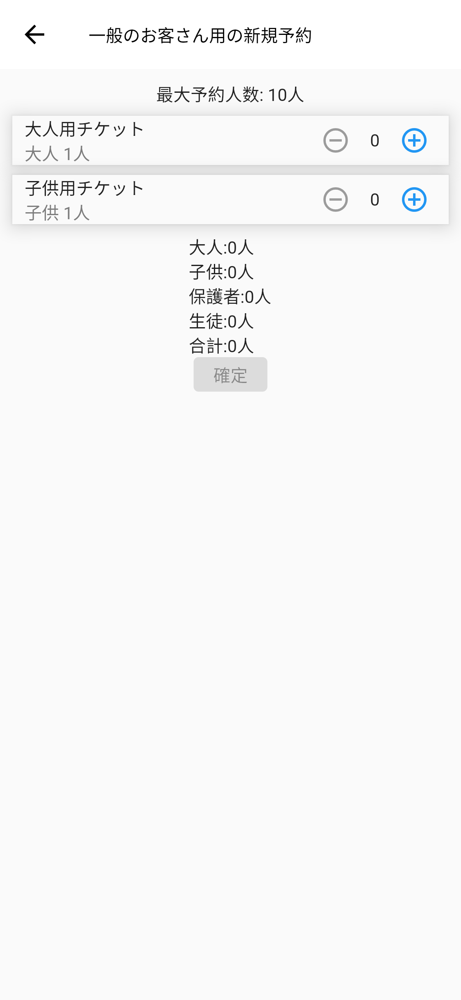
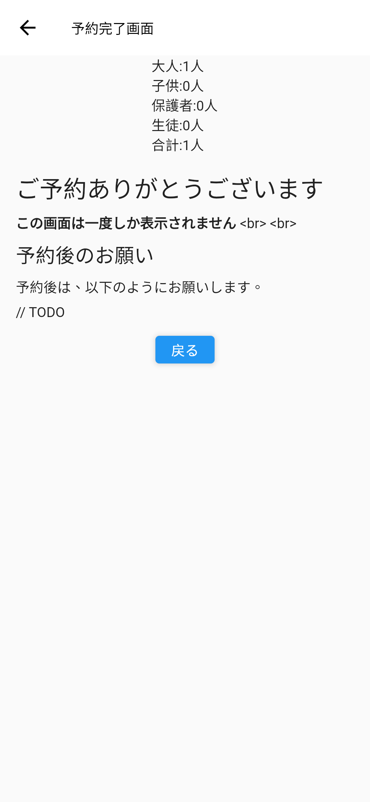
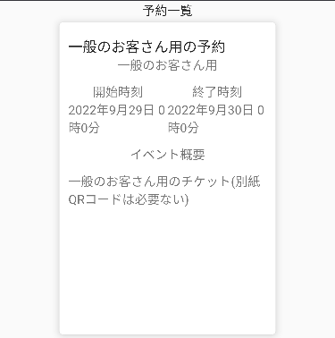
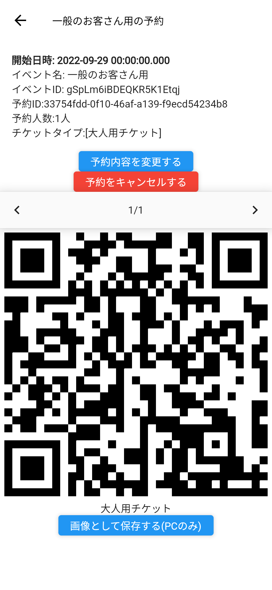

# エンドユーザー用マニュアル
Mayaのエンドユーザー向けマニュアルです。

主に新規登録方法・予約方法・予約状況確認方法を説明します。

また、このマニュアルの画像は開発途中の物であり、実際とは異なる可能性があります。

## 新規登録手順(初回のみ)

1. アプリにアクセスします。 

2. Loginボタンを押します。 
3. 電話番号を入力します。 

4. 「電話番号を認証」ボタンを押します。 
5. (ReCaptcha認証を行います。(Google側の機嫌で表示されるかどうかが変わってきます。)) 

6. SMSに送信されてくる認証コードを入力します。 

7. 「認証」ボタンを押します。 
8. 完了です! 

## 予約手順
1. 予約したいイベントを選択します。 

2. 予約するイベントを選択します。 

3. 「予約する」ボタンを押します。 

4. 予約するチケットの枚数を入力して「確定」ボタンを押します。 

5. 少し待ちます。 
6. 予約完了画面を確認して「戻る」ボタンを押します。 

7. 予約一覧に予約が増えていることを確認します。 

8. 完了です!

## 予約状況確認手順
1. 予約一覧から確認したい予約を選択します。 
2. 予約状況を確認します。 
