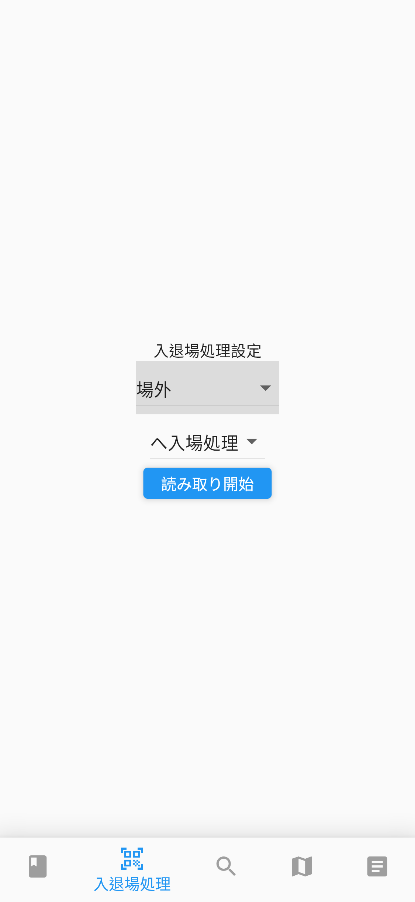
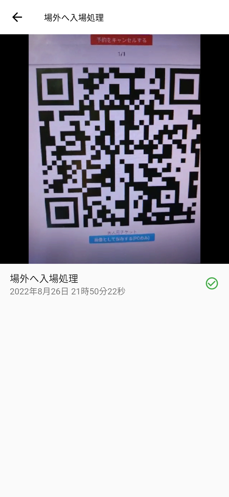
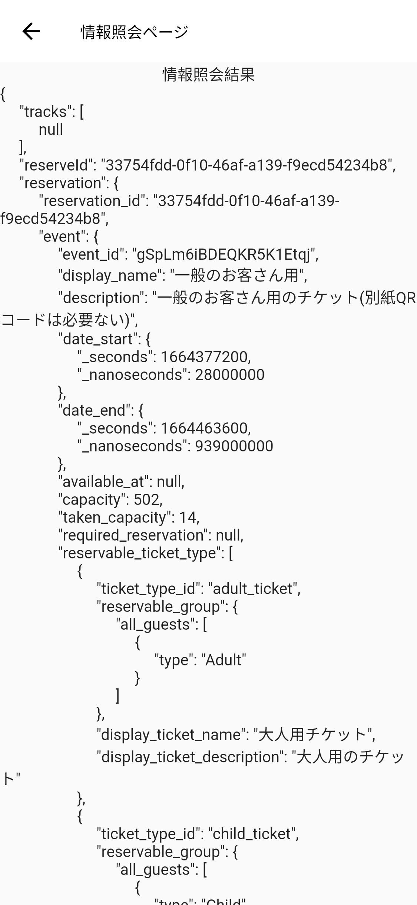

# スタッフ向けマニュアル
Mayaのスタッフ向けのマニュアルです。

主に、入退場取り扱い・情報照会手順を説明します。

このマニュアルの画像は開発途中の物であり、実際とは異なる可能性があります。

## 入退場手順
1. 入退場ボタンを押します。(少し待っても表示されない場合は、システム管理者に問い合わせてください。)

2. 入退場処理の設定を行います。

3. 「読み取り開始」ボタンを押します。

4. (カメラの権限を要求される場合は、許可します。)
5. カメラでお客さんのチケットを読み取ります。
6. 読み取り結果の横に砂時計が表示されることを確認します。

7. 数秒待って砂時計が緑のチェックマークになることを確認します。

8. (もし、赤のビックリマークになった場合は、正しく入退場処理が出来なかったことを示しています。チケットの種類がその部屋に入場できる種類であるかを確認したのち、システム管理者に問い合わせてください。)
9. お客さんが来るたびにこの処理を繰り返します。

## 情報照会手順
1. 情報照会ボタンを押します。(少し待っても表示されない場合は、システム管理者に問い合わせてください。)

2. 「情報照会」ボタンを押します。

3. 当該チケットのQRコードを読み取ります。
4. 少し待ちます
5. 結果が表示されます。
